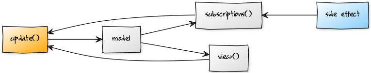

# React + RxJS -> Elmish

> __Proof of Concept__ - [Rx(ified)](http://reactivex.io/rxjs/) and [React(ified)](https://facebook.github.io/react/docs/introducing-jsx.html) version for a better understanding of the [Elm Architecture](https://guide.elm-lang.org/architecture/). Don't use in production!

## [Live](https://reactish-elmish.services.dropstack.run)

## Setup

```bash
npm install
npm test
npm run dev
```

## Build

```bash
npm run build
```

## Deploy to [https://dropstack.run](https://dropstack.run)

```bash
npm run deploy
```

## Flow



* [Optimistic Updates / UI](docs/optimistic-update.md)

## Introduction

* Frontend-Developer friendly syntax and semantic (similar to Event/Game-Loop)
* Fits for "smart" components (side effects + state management + logic + rendering)
* Stateless React Functions for "dumb" components
* Component based state and side effect management (avoid central state)
* Minimal inversive - combine React-Rendering and Reactive Extentions without building a Framework with unnecessary abstractions
* Follow the principle of "reactive" fold left with [Rx Scan Operator](http://rxmarbles.com/#scan)
* Async/Sync side effect orchestration via [Rx-Observables](http://reactivex.io/rxjs/class/es6/Observable.js~Observable.html)

## Examples

* [All in One](http://reactish-elmish.services.dropstack.run/allinone)
* [Counter](http://reactish-elmish.services.dropstack.run/counter)
* [Counter delayed](http://reactish-elmish.services.dropstack.run/counterdelayed)
* [Counter composed](http://reactish-elmish.services.dropstack.run/countercomposed)
* [Form / Validation](http://reactish-elmish.services.dropstack.run/form)
* [Interval component](http://reactish-elmish.services.dropstack.run/intervalcomponent)
* [Interval component via functional composition](http://reactish-elmish.services.dropstack.run/intervalcomponentcompose)
* [Random Gif (Fetch)](http://reactish-elmish.services.dropstack.run/randomgiffetch)
* [Random Gif (Rx)](http://reactish-elmish.services.dropstack.run/randomgifrx)
* [Optimistic UI updates](http://reactish-elmish.services.dropstack.run/optimisticupdate)
* [Long-Running Process (aka Saga) (RxJs)](http://reactish-elmish.services.dropstack.run/ordersaga)
* [CouchDB/PouchDB change feed via AJAX long polling](http://reactish-elmish.services.dropstack.run/webevents)
* [EventSource via HTTP/2 push notifications](http://reactish-elmish.services.dropstack.run/http2eventsource)
* [Inter-component communication via global/parent state handling (aka createStore/reducer)](http://reactish-elmish.services.dropstack.run/componentcommunication)
* [Inter-component communication via streams (RxJs)](http://reactish-elmish.services.dropstack.run/componentcommunicationviastream)
* [Component composition with GraphQL data fetching (Apollo-Client)](http://reactish-elmish.services.dropstack.run/componentwithgraphql)

## Elmish API

**init()** function, returning the initial state (a state is an object with a required key model and an optional key cmd)

**update(model, msg)** reduce function, returns the new state

**view(model, update)** function, returns the updated UI (React)

**subscription(cmd, msgStream)** function, manage composable side effects returns a stream of messages (Rx Observable)

## Reactish API

### Use Reactish-Elmish with functional composition (compose / withElmish)

```javascript
import React from 'react'
import Rx from 'rx'
import { compose, withElmish } from '../../lib'

// Render view
export const Interval = props => (
  <div className="widget">
    Component interval counter via functional composition: {props.model.count}
  </div>
)

const elmishInterval = withElmish({
  // Prepare initial state
  init () {
    return {
      model: {
        count: 0
      },
      cmd: 'INTERVAL_START'
    }
  },
  // Update state
  update (model, msg) {
    model.count += 1
    return { model }
  },
  // Attach subscriptions to external side-effects
  subscriptions (cmd) {
    switch (cmd) {
      case 'INTERVAL_START':
        return Rx.Observable.interval(1000).map(x => 'INTERVAL_ELAPSED')
    }
  }
})

export default compose(elmishInterval)(Interval)
```

### Use Reactish-Elmish with class extention

```javascript
import React from 'react'
import { ReactComponent } from '../../lib'

export default class MyComponent extends ReactComponent {
  // Prepare initial state
  init() {
    return {
      model: { something: 'init', }
    }
  }

  // Update state
  update(model, msg) {
    switch (msg.type) {
      case 'DO_SOMETHING':
        return {
          model: { something: 'Foo Bar', }
        }
      default:
        return {
          model
        }
    }
  }

  // Render view
  view(model, update) {
    return (
      <div>
        {JSON.stringify(model, null, 4)}
        <button onClick={() => update({type: 'DO_SOMETHING', model})}>Click</button>
      </div>
    )
  }

}
```

## Todos

* Debounce / Throttle example
